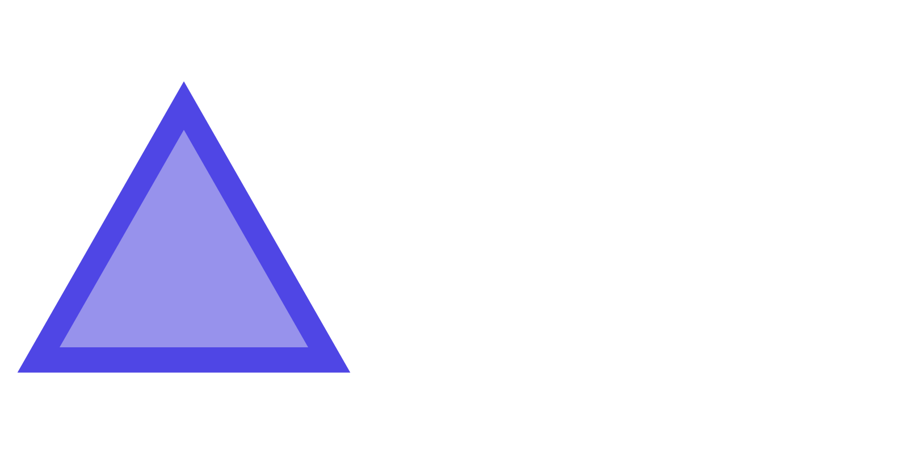
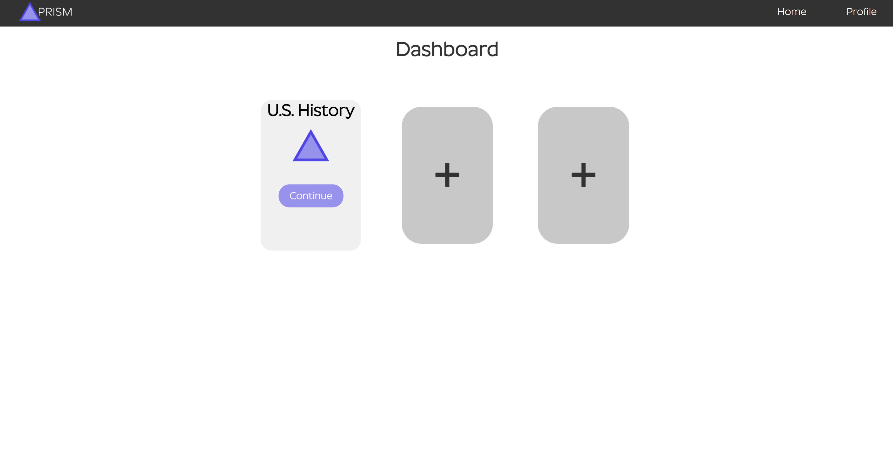
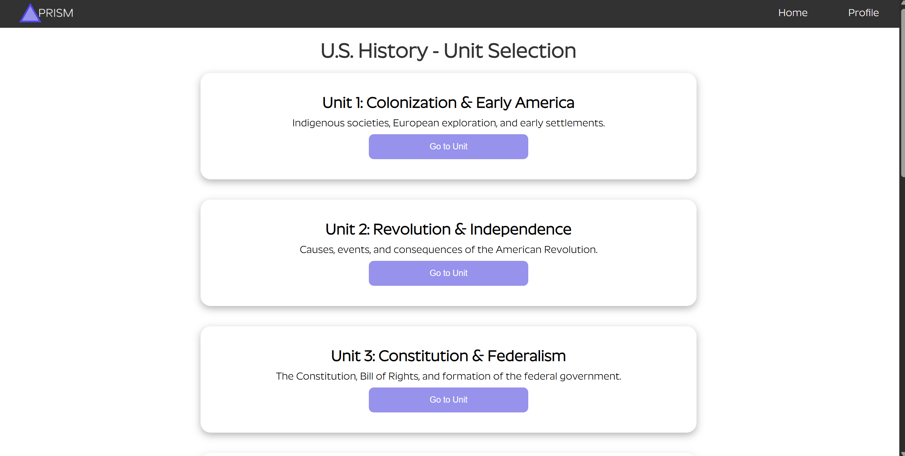
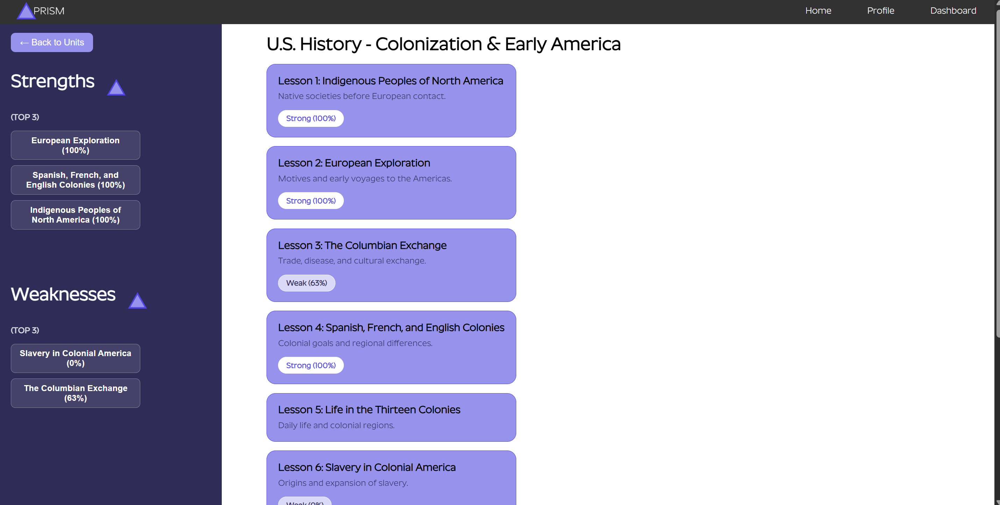
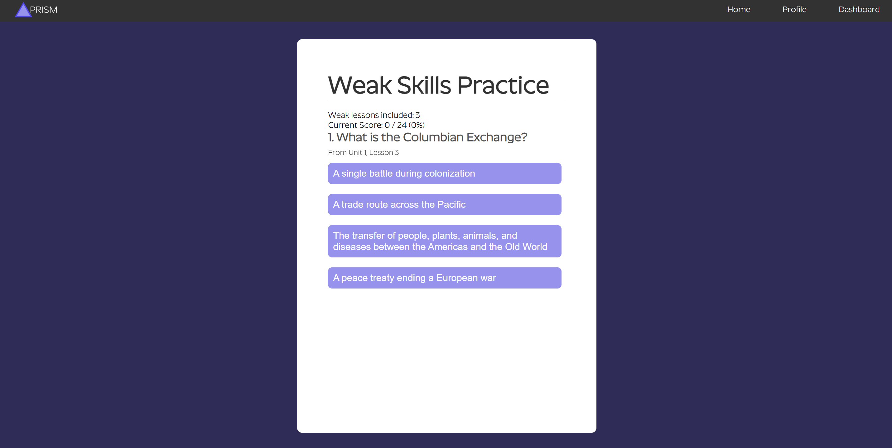
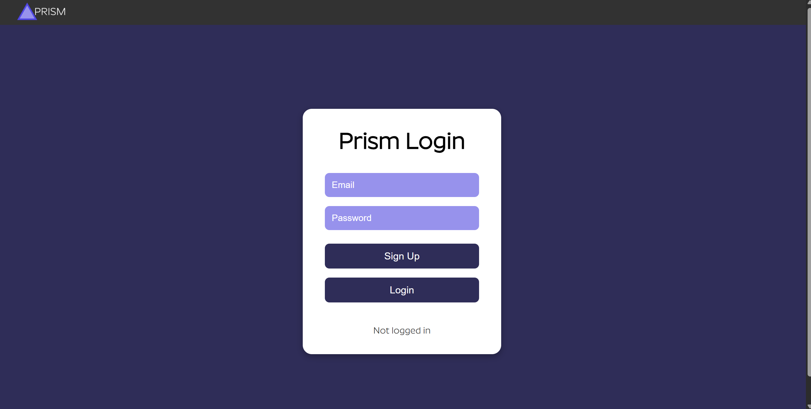

# Prism



**Personalized Learning for Every Student**

Prism is an adaptive learning platform I independently designed and developed as my senior-year computer science project. It personalizes practice based on each student's performance, tracks learning progress, identifies areas of weakness, and provides targeted practice to help students improve.

---

## Overview

Traditional education often follows a one-size-fits-all model that can overlook individual differences in student performance. Prism uses performance-based adaptive logic to create a more personalized learning experience.

Rather than giving every student the same practice, Prism analyzes their performance and directs additional practice toward areas where they demonstrate difficulty.
> **Note:** Prism is a completed project but is not currently deployed as a publicly accessible web application.

## Features

* **Adaptive Learning** — Uses student performance data to identify areas that need additional practice
* **Weak Skills Practice** — Automatically generates targeted practice based on lower-performing lessons
* **Progress Tracking** — Records lesson performance, attempts, scores, and completion progress
* **User Accounts** — Uses Firebase Authentication to provide individual student accounts
* **Persistent Progress** — Stores student learning data using Cloud Firestore
* **Modular Lesson Structure** — Separates educational content from application logic using JSON
* **Unit Progression** — Tracks completed lessons and units to manage learning progression
* **End-of-Unit Assessments** — Provides assessments to evaluate understanding after completing a unit

---

## How the Adaptive System Works

Prism uses a **rule-based adaptive learning system** to identify areas where students may need additional practice.

After completing a lesson, Prism records the student's performance. Lessons with performance below the adaptive threshold are identified as weak areas and can be included in a targeted **Weak Skills Practice** session.

```text
Student completes a lesson
          ↓
Performance is recorded
          ↓
Performance is analyzed
          ↓
Weak areas are identified
          ↓
Targeted practice is generated
          ↓
Student reviews areas of difficulty
```

This allows students to spend more time practicing concepts they have not yet mastered.

---

## Tech Stack

* **Frontend:** HTML, CSS, JavaScript
* **Authentication:** Firebase Authentication
* **Database:** Cloud Firestore
* **Content:** JSON

---

## Architecture

Prism is a client-side web application integrated with Firebase services.

```text
┌─────────────────────────────┐
│        Prism Frontend       │
│       HTML / CSS / JS       │
└──────────────┬──────────────┘
               │
       ┌───────┴────────┐
       ↓                ↓
Firebase Auth     Cloud Firestore
                       │
                       ↓
              Student Performance
                  & Progress
                       │
                       ↓
               Adaptive Logic
                       │
                       ↓
              Weak Skills Practice
```

Educational content is stored separately from the application's core logic, making it easier to add additional lessons and units without restructuring the core application.

---

## Screenshots

### Dashboard


### Units


### Lesson Dashboard


### Weak Skills Practice


### Login


---

## Project Structure

```text
PRISM/
├── javascript/
│   ├── auth.js
│   ├── firebase.js
│   ├── lesson.js
│   ├── category.js
│   ├── unit-selection.js
│   ├── menu.js
│   └── ...
│
├── css/
│   └── ...
│
├── *.html
│
└── ...
```

---

## Data & Security

Prism uses Firebase Authentication to identify users and Cloud Firestore to store individual learning progress.

Firestore security rules restrict users to reading and writing their own private user data. Educational lesson and unit content is publicly readable but cannot be modified by users.

---

## Development

The project involved designing and implementing:

* A web-based learning platform
* User authentication and accounts
* Persistent student progress
* Performance tracking
* Rule-based adaptive learning logic
* Targeted weak-skill practice
* Modular educational content
* Unit and lesson progression
* End-of-unit assessments

---

## Future Improvements

Potential future improvements include:

* Expanding Prism to additional subjects
* More sophisticated adaptive learning algorithms
* Improved learning analytics and visualizations
* Teacher and instructor dashboards
* Additional assessment formats
* Public deployment
* More advanced personalization based on long-term performance patterns

---

## Author

**Trevor Minkiewicz**

Prism was independently designed and developed as a high school senior-year computer science project.
